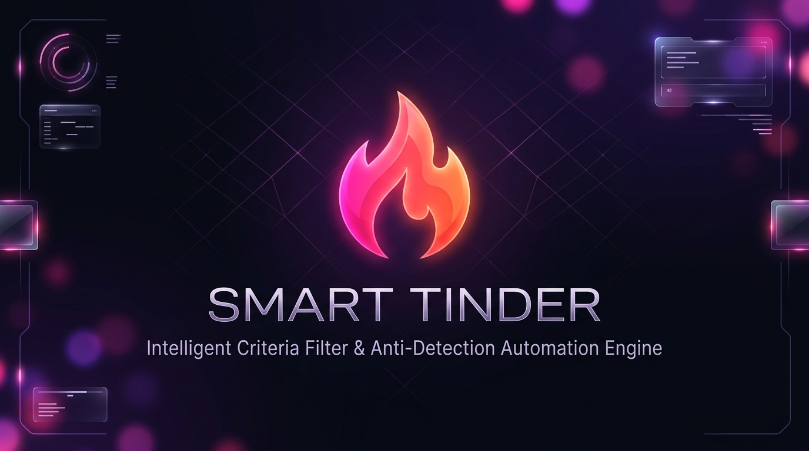
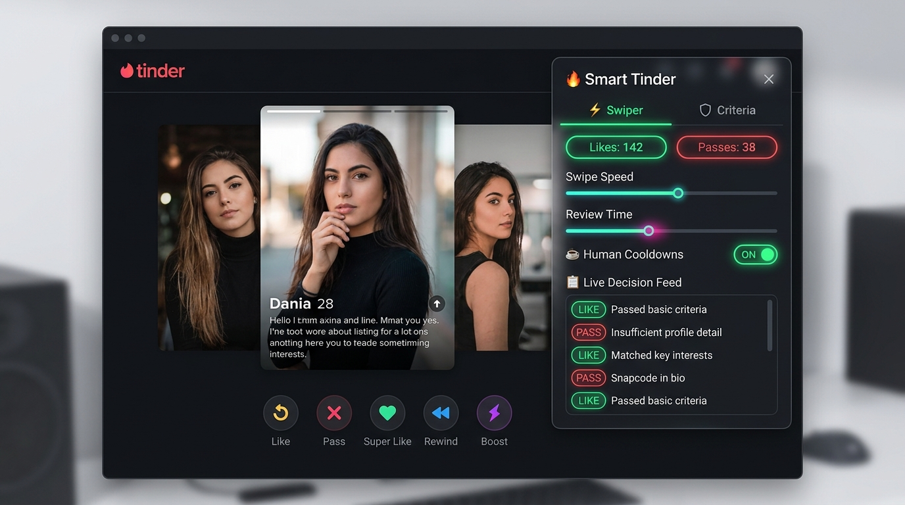

<div align="center">



# 🔥 Smart Tinder

**An intelligent, automated assistant and criteria filter engine for Tinder Web.**  
Featuring deterministic negative filtering, human-like interaction loops, category rotation, and a sleek glassmorphic HUD.

---

[](https://github.com/Crypto90/smart-tinder/releases)
[](https://www.electronjs.org/)
[](https://nodejs.org/)
[](https://github.com/Crypto90/smart-tinder)
[](LICENSE)

</div>

---

## 🌟 Overview

**Smart Tinder** is a standalone Electron desktop application that wraps Tinder Web with an unobtrusive, floating glassmorphic control widget. It eliminates tedious manual swiping while giving you granular, deterministic control over which profiles you match with.

Instead of blind mass-swiping or random heuristics, Smart Tinder inspects profile content (bios, lifestyle pills, pronouns, relationship intent, and distance) against customizable criteria before dispatching any action.

<div align="center" style="margin: 24px 0;">
  
  <p><em>Desktop application with the floating glassmorphic HUD: Live Decision Feed, real-time counters, and anti-shadowban cooldown controls.</em></p>
</div>

---

## ✨ Key Features

### 🛡️ Smart Criteria & Negative Filter Engine
- **Deterministic Left-Swipes**: Automatically passes on profiles that match your exclusion criteria before considering a like.
- **Categorized Presets (One-Click Toggles)**:
  - ⚧️ **Gender & Pronouns**: `he/him`, `they/them`, `er/ihn`, `she/they`, `trans`, `transgender`, `ladyboy`, `crossdresser`, `t-girl`, `shemale`, `ftm`, `mtf`
  - 👥 **Couples & Poly**: `couple`, `looking for third`, `dreier`, `paar`, `unicorn`
  - 💸 **Promo & Spam**: `onlyfans`, `cashapp`, `paypal.me`, `sugar baby`, `insta:`, `ig:`, `snap:`, `sc:`
- **Advanced Profile Filters**:
  - 📝 **Bio Required**: Auto-passes profiles with empty or low-effort bios (< 6 characters).
  - ☑️ **Verified Only**: Auto-passes unverified accounts lacking Tinder's blue checkmark.
  - 🎂 **Age Range Cap**: Enforce strict minimum and maximum age brackets directly in the HUD.
- **Custom Keywords**: Add any custom keyword or phrase with instant chip management.
- **Maximum Distance Cap**: Set a maximum distance in kilometers (`0` to disable). Profiles exceeding this range are passed automatically.
- **Configurable Pass Rate**: Random pass rate slider (0% to 50%). Set to `0%` for 100% likes on all passing profiles.
- **Preset Portability**: 1-click JSON Export & Import to backup, restore, and swap configuration profiles.

### ⚡ Human-Like Swiping Automation & Anti-Detection
- **Natural Timing**: Configurable base speed (0.5s – 5.0s) plus random jitter delays (0.0s – 3.0s) to mimic human rhythm.
- **☕ Anti-Shadowban Cooldowns**: Natural periodic breaks (40–60s) every 20–30 swipes with a live countdown and instant `[Skip Break]` option.
- **Micro-Inspection Simulation**: Subtle 15% random photo viewing pauses before deciding to mimic natural gaze patterns.
- **Dual-Action Fallback Engine**: Dispatches native keyboard arrow events (`ArrowRight` / `ArrowLeft`) with an automated button-click fallback after 350ms if the DOM card doesn't advance.
- **Anti-Stall & Popup Dismissal**: Automatically closes match modals (*"Keep Swiping"* / *"Weiterswipen"*), system dialogs (*"Not now"*, *"Nicht jetzt"*), and paywall popups across languages (English & German).

### 🗂️ Explore Category Looping & Queue Management
- **Zero Page Reload Navigation**: Fast, native client-side SPA navigation between Explore categories and regular stacks with no page flushes.
- **Category Scanner**: Detects all active Tinder Explore categories (`/app/explore/...`) and lets you select which stacks to swipe.
- **Category Swipe Limits**: Configurable per-category swipe budget (10 – 250 swipes).
- **Auto-Loop Mode**: Automatically rotates through selected categories and restarts the queue once exhausted.

### 🎨 Modern Glassmorphic HUD
- **Tabbed Interface**:
  - **`⚡ Swiper`**: Real-time Likes/Passes counters, Category progress, Live Decision Feed, Cooldown toggles, and speed sliders.
  - **`🛡️ Criteria`**: Full-height dedicated tag manager with active badge counts, advanced filters, distance, age, and JSON preset export/import.
- **📋 Live Decision Feed**: Real-time audit log of the last 10 profile evaluations (name, age, action, reason, timestamp) and neon card glow visual feedback.
- **Draggable & Dockable**: Move the widget anywhere on screen with boundary clamping; position persists across reloads.
- **Compact Mode**: Collapse into an ultra-minimal horizontal status bar (`🗕`).
- **Developer Console Integration**: Clean startup with DevTools hidden by default. Toggle anytime via the `🛠️` header button or standard shortcuts (`F12`, `Cmd+Option+I`).

## 📦 Downloads & Precompiled Releases

Download the latest version directly from the [**GitHub Releases**](https://github.com/Crypto90/smart-tinder/releases/latest) page:

| Platform | Format | Architectures | Instructions |
| :--- | :--- | :--- | :--- |
| 🍏 **macOS** | `.dmg`, `.zip` | Apple Silicon (`arm64`), Intel (`x64`) | Drag to Applications. Open with Right-Click -> Open on first run. |
| 🪟 **Windows** | `.exe` (Installer), Portable `.exe` | `x64` | Run the installer or standalone executable. |
| 🐧 **Linux** | `.AppImage`, `.deb` | `x64` | Make executable (`chmod +x *.AppImage`) or install `.deb`. |

> [!TIP]
> **Automatic Update Checker**: Smart Tinder automatically checks GitHub for newer releases on startup and displays an in-app banner (`🚀 Update available!`) with a 1-click update link. You can also manually check anytime via the `🔄` header button.

---

## 🚀 Getting Started

### Prerequisites
- [Node.js](https://nodejs.org/) (v18 or newer recommended)
- `npm` (bundled with Node.js)

### Installation

1. **Clone the repository:**
   ```bash
   git clone https://github.com/Crypto90/smart-tinder.git
   cd smart-tinder
   ```

2. **Install dependencies:**
   ```bash
   npm install
   ```

3. **Run automated test suite:**
   ```bash
   npm test
   ```

4. **Start the application in development mode:**
   ```bash
   npm start
   ```

### 🛠️ Building & Packaging for Production

Package standalone desktop installers locally using `electron-builder`:

```bash
# Package for macOS (.dmg, .zip for arm64 & x64)
npm run build:mac

# Package for Windows (.exe NSIS installer & portable .exe)
npm run build:win

# Package for Linux (.AppImage & .deb)
npm run build:linux

# Package all platforms simultaneously
npm run build:all
```
All packaged files are output to the `dist/` directory.

---

## 🕹️ Usage Guide

1. **Login**: When the window opens, log in to your Tinder account as usual.
2. **Configure Criteria**:
   - Click the **`🛡️ Criteria`** tab in the widget.
   - Click any preset pill to toggle it on (`✓`) or off (`+`).
   - Add any custom keywords in the text field.
   - Optionally set a **Max Distance** limit.
3. **Set Automation Parameters**:
   - Switch back to the **`⚡ Swiper`** tab.
   - Adjust **Base Speed** and **Random Jitter**.
   - If you want 100% likes on passing profiles, set **Random Pass Rate** to `0%`.
4. **Select Explore Categories (Optional)**:
   - Click **Scan** under Categories to detect available stacks.
   - Check the categories you want to include, and toggle **Auto-Loop Categories** if desired.
5. **Start**: Click **START** to begin. Click **STOP** anytime to pause.

---

## ⌨️ Keyboard Shortcuts

| Shortcut | Description |
| :--- | :--- |
| `F12` | Toggle Developer Console / DevTools |
| `Cmd + Option + I` / `Ctrl + Shift + I` | Toggle Developer Console / DevTools |
| `Cmd + R` / `Ctrl + R` | Reload Web Session & Reinitialize HUD |

---

## 🏗️ Project Architecture

```
smart-tinder/
├── assets/         # App banner, interface mockups, and media
├── main.js         # Electron main process (lifecycle, window creation, CSP bypass, IPC)
├── preload.js      # Automation engine, criteria evaluation, DOM injection & HUD
├── test_suite.js   # Automated unit test runner (10 verification suites)
├── package.json    # Project manifest, scripts, and dependencies
└── .gitignore      # Git exclusion rules
```

### Security & Privacy
- **Direct Web Access**: Connects directly to `https://tinder.com` inside an isolated Chromium web context.
- **No Third-Party APIs**: All processing (filtering, evaluations, queue management) runs locally on your machine. No telemetry, credentials, or profile data are collected or sent externally.
- **Persistent Local Storage**: Widget settings and criteria are stored strictly in your local `localStorage`.

---

## 📄 License

This project is licensed under the [MIT License](LICENSE).

---

<div align="center">
  <sub>Built with ❤️ for intelligent, effortless automation.</sub>
</div>
